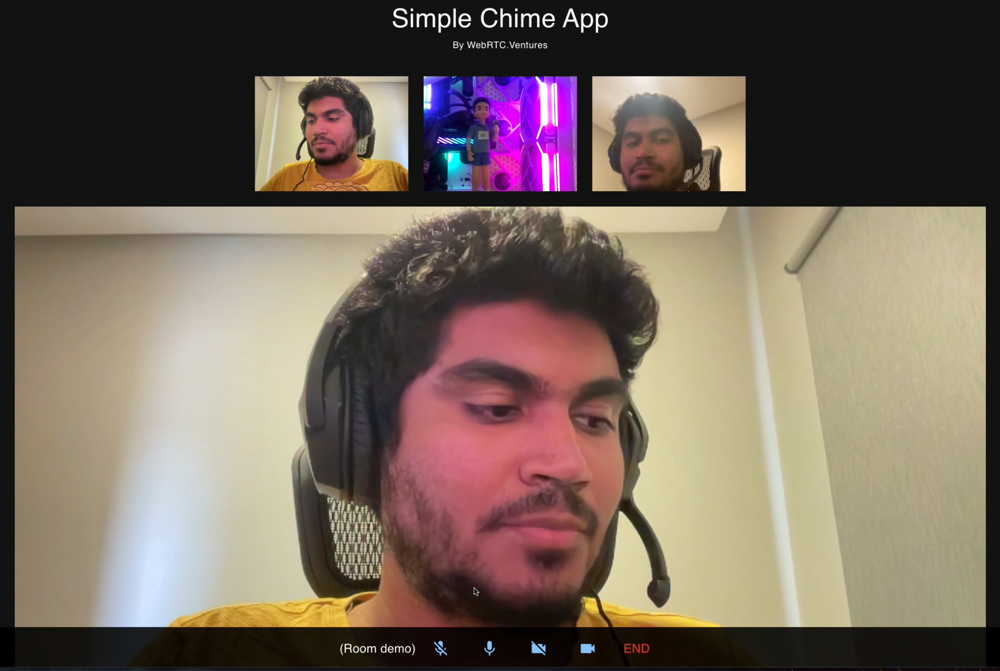

# Simple Amazon Chime SDK Application

## Frontend

> Very simple video conference app using AWS Chime.



It requires [the backend](https://github.com/WebRTCventures/simple-chime-backend) running.

For setting up, using **Node 16**, download the dependencies and run the development server:

```sh
npm install
npm start
```

That's it.
